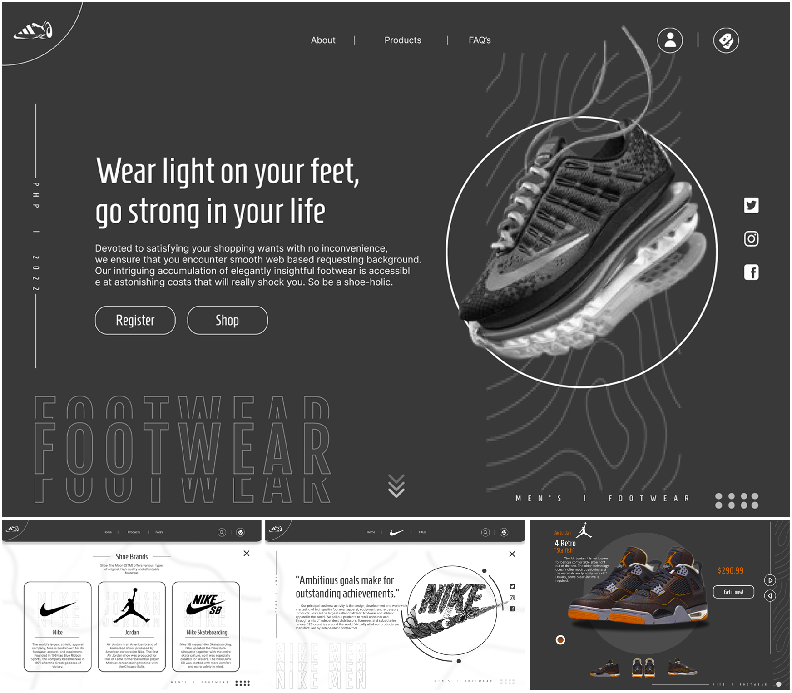
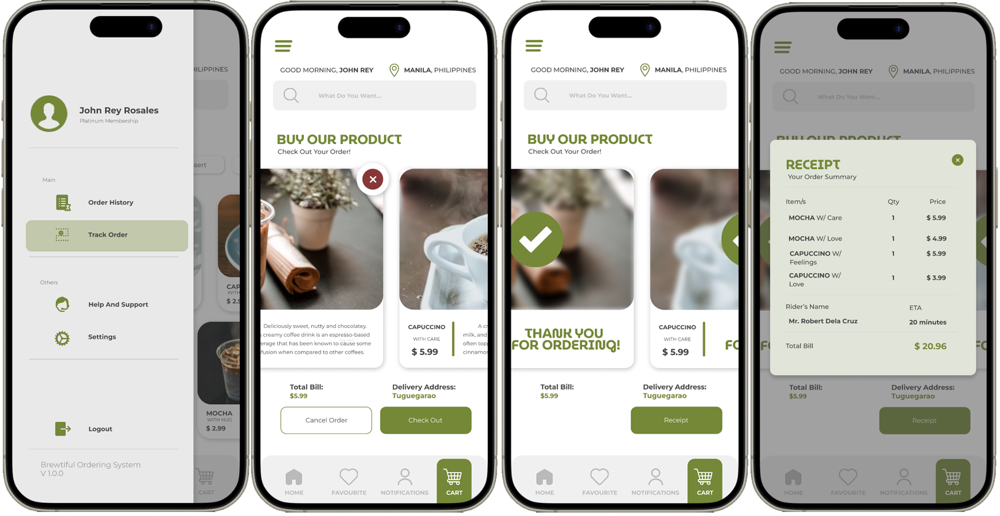

## INTRODUCTION
#### About Me:
[Downloadable CV]

___

## PROJECTS

### Project System
#### BangBrew Ordering System
- Description:
- Programming Language:
- Image:

#### QCU Voting System
- Description:
- Programming Language:
- Image:

#### Simple MVC Profile
- Description:
- Programming Language:
- Image:

___

### **System Design Project**
#### Shoe Ordering System (_Desktop_)
- Description:
- Programming Language:
  

#### **Loan Release System** (_Desktop_)
- Description:
- Programming Language:
- Image:

#### **QCU Voting System** (_Desktop_)
- Description:
- Programming Language:
- Image:

#### **Coffee Ordering System** (_Mobile_)
- Description:
- Programming Language:

  
#### **Leandro Locsin Integrated School** (_Website_)
- Description:
- Programming Language:
- Image:

#### **Leandro Locsin Integrated School** (_Desktop_)
- Description:
- Programming Language:
- Image:

  
___

## Skills
#### Technical Skills:
- Java
- C#

#### Design Skills:
- Illustrator
- Photoshop
- Figma
- Canva

