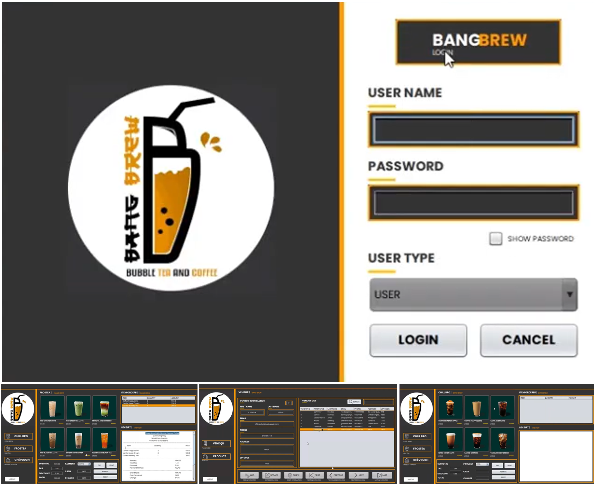
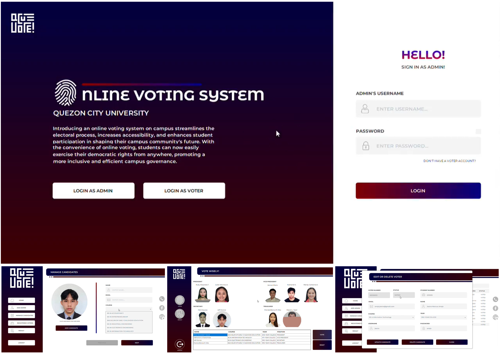
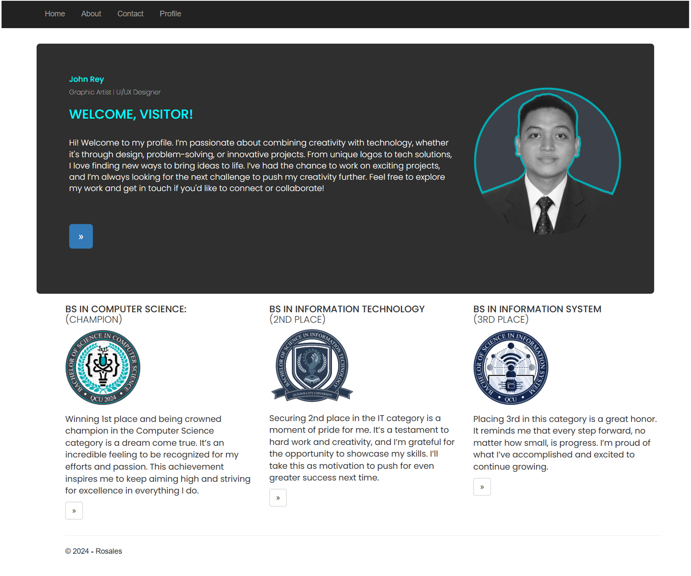
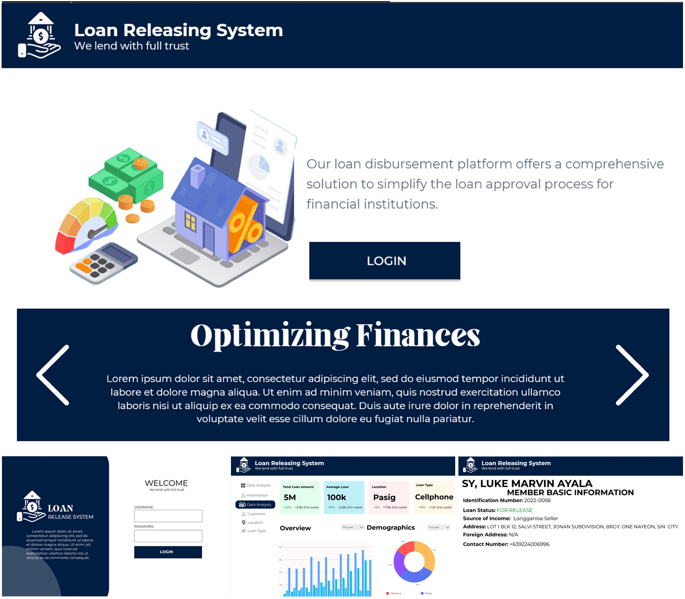
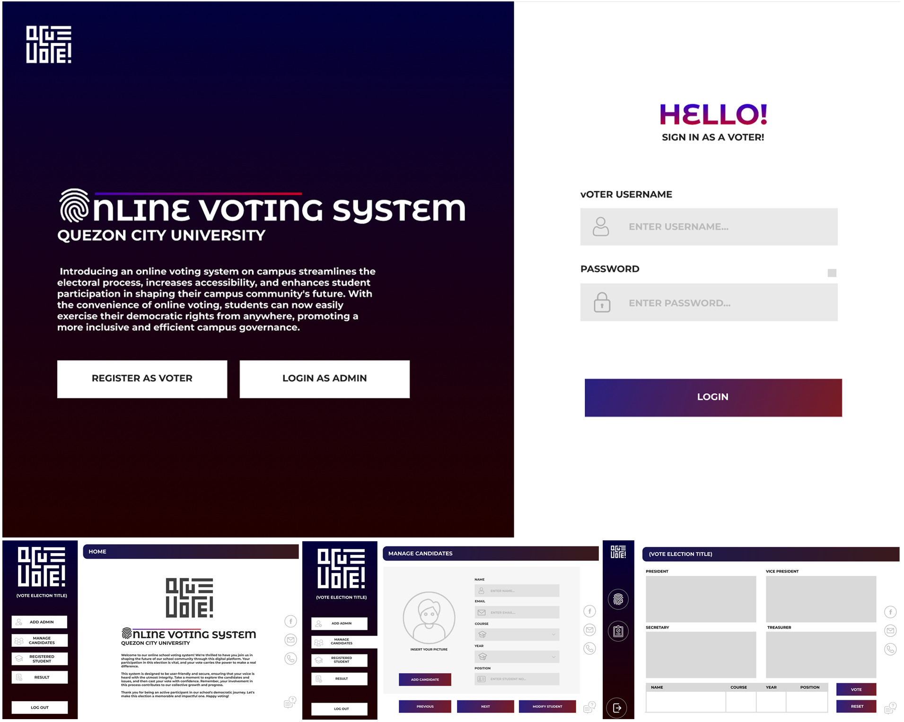
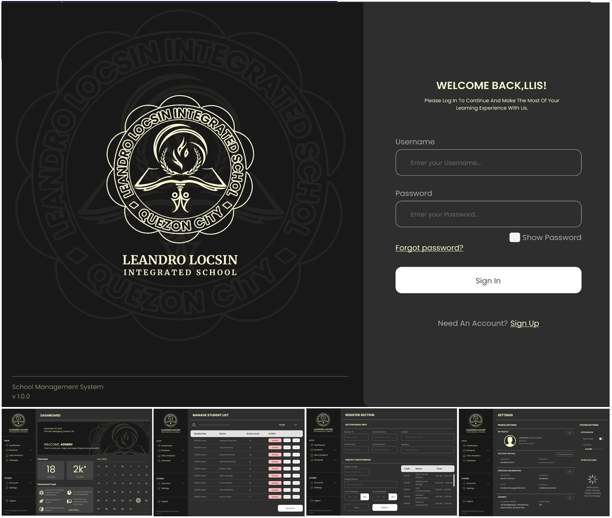
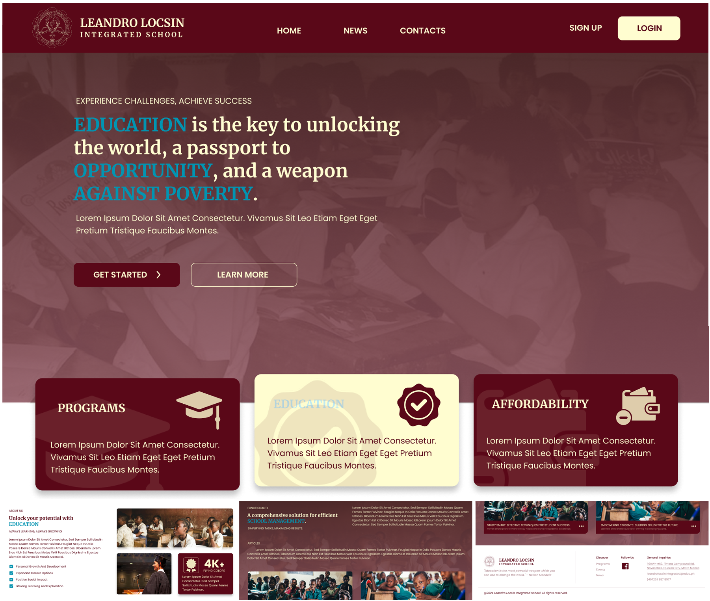

## INTRODUCTION
### About Me

> Hey there! I’m John Rey Rosales, your friendly neighborhood designer. I spend my days diving into the world of design—whether it’s sketching on paper or clicking away on my computer, I’m always on the lookout for new tools to level up my creative game.

> I’m an experienced UI/UX designer and an aspiring front-end developer with a passion for creating clean, engaging, and user-focused digital experiences. I enjoy turning ideas into intuitive designs and am constantly expanding my skills in front-end development to bring those designs to life. With a background in Java programming and a strong foundation in visual design, I bridge both creativity and functionality. I’m also well-versed in Adobe Creative Suite and typography, allowing me to deliver visually impactful solutions that meet both user needs and project goals. I’m always eager to learn new technologies, collaborate on innovative projects, and grow in the ever-evolving world of design and development.

[Downloadable CV](https://drive.google.com/file/d/17P8vzRIvObTUUd75ROWXdWiIwYTl8V4E/view?usp=sharing)

___

## WORK EXPERIENCE

**GraphicArtist @ [TAPP.PHPrintingServices] (https://www.facebook.com/TAPPClothingAndApparel) (September 2023 - Semptembere 2024)

- Created digital image files for use in digital and traditional printing methods.
- Designed website layouts, templates,and unique branded looks.
- Collaborated with clients to create visually appealing designs for print and digital media, meeting project deadlines and maintaining client satisfaction.

___

## CONTACT ME

I’m always excited to work on creative projects and bring ideas to life! Whether it’s a collaboration or a commission, feel free to reach out. Let’s create something amazing together!

__Socials__

___

__Mobile Number:__ +63 993 6768 737

__Location:__ [Jose Abad Santos, Novaliches, Quezon City, Metro Manila, Philippines](https://maps.app.goo.gl/rLCAmkpS49Hiw94PA)

__Email:__ *rosales.johnrey.agpalza@gmail.com*

___

Looking forward to hearing from you!

___

## SKILLS

|Technical        | Proficiency        |
|--------------|--------------------|
| *Java*     | [██████████] 90%   |
| *C#*      | [████████░░] 80%   |

|Design       | Proficiency        |
|--------------|--------------------|
| *Illustrator* | [███████░░░] 70% |
| *Photoshop* | [██████████] 95%   |
| *Figma*    | [██████████] 95%   |
| *Canva*    | [██████████] 90%   |

___

## PROJECTS

### Project System

#### ___BangBrew Ordering System___
__May 2023__

Overview

> The Bangbrew Ordering System is a digital platform that simplifies milk tea ordering. It features a user-friendly interface for browsing the menu, customizing drinks, and making secure payments. Key features include real-time order tracking and promotional offers, enhancing customer satisfaction and convenience.

Programming Language: ___Java with XAMPP Database___

Position: ___UI/UX Designer, Programmer, Project Manager___

[System Video Demonstration](https://drive.google.com/file/d/1Hhtnuk_VziSX_HN9Ec5jb5WojCXiw5eq/view?usp=sharing)

___

#### ___QCU Voting System___
__December 2023__

Overview
  
  > The online voting system at Quezon City University (QCU) enables members to cast their votes electronically, ensuring convenience and accessibility. This system is designed to maintain the integrity of the voting process, preventing multiple votes from a single voter.

Programming Language: ___Java with XAMPP Database___

Position: ___UI/UX Designer, Programmer___

[System Video Demonstration](https://drive.google.com/file/d/1VZSkqYE48eyS8SrvtFdMhC4YDkLuNtCk/view?usp=sharing)

#### ___Simple MVC Profile___
__November 2024__

Overview
  
  > The Loan Release System is designed to simplify the management of loan applications, providing clear dashboards for both applicants and administrators. Users can easily track application statuses, upload necessary documents, and view payment schedules, all within a user-friendly layout.
  
Programming Language: ___Visual Studio C# MVC___

Position: ___UI/UX Designer, Programmer___

  
___

### System Design Project

#### ___Shoe Ordering System___ (_Desktop_)
__December 2022__

Overview
  
  > The Shoe Ordering System offers a seamless shopping experience with an organized catalog of footwear, detailed product descriptions, and customizable options. Users can easily filter by size, color, and brand, ensuring a convenient and enjoyable purchasing process.
  
Software Used: ___Figma___

Position: ___UI/UX Designer___
  
___

#### ___Loan Release System___ (_Desktop_)
__Arpil 2024__

Overview
  
  > The Loan Release System is designed to simplify the management of loan applications, providing clear dashboards for both applicants and administrators. Users can easily track application statuses, upload necessary documents, and view payment schedules, all within a user-friendly layout.
  
Software Used: ___Figma___

Position: ___UI/UX Designer___

___

#### ___QCU Voting System___ (_Desktop_)
__November 2023__

Overview

  > The Online Voting System offers a secure and accessible platform for voters to register and cast their ballots. With a clean design and straightforward navigation, users can easily participate in elections and view real-time results, ensuring a trustworthy voting process.
  
Software Used: ___Figma___

Position: ___UI/UX Designer___

___

#### ___Coffee Ordering System___ (_Mobile_)
__December 2024__

Overview

  > The Coffee Ordering System features an intuitive interface that allows customers to easily browse the menu, customize their drinks, and complete secure transactions. Its streamlined design enhances the ordering experience, making it quick and enjoyable for coffee enthusiasts.
  
Software Used: ___Figma___

Position: ___UI/UX Designer___

___

#### ___Leandro Locsin Integrated School___ (_Desktop_)
__February 2025__

Overview

   > The School Management System for desktop streamlines administrative tasks within educational institutions, including student enrollment, attendance tracking, and grade management. Its organized layout allows for quick access to essential features, enhancing overall efficiency for staff and administrators.
  
Software Used: ___Figma___
 
Position: ___UI/UX Designer___

___
  
#### **Leandro Locsin Integrated School** (_Website_)
__January 2025__

Overview

  > The School Management System website provides a responsive platform for students, parents, and staff, featuring announcements, event calendars, and downloadable resources. Designed for ease of use, it promotes engagement and communication among all stakeholders in the school community.
  
Software Used: ___Figma___

Position: ___UI/UX Designer___
  
___

