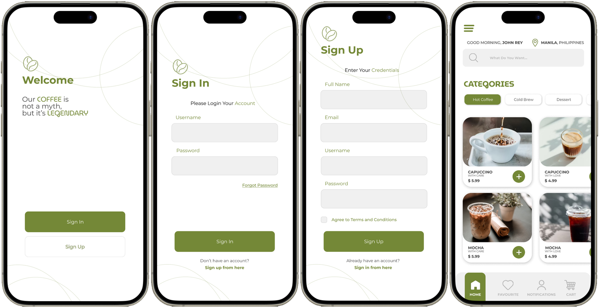

## INTRODUCTION
#### About Me

> Hey there! I’m John Rey Rosales, your friendly neighborhood designer. I spend my days diving into the world of design—whether it’s sketching on paper or clicking away on my computer, I’m always on the lookout for new tools to level up my creative game.

> When I’m not busy crafting visuals, you can find me exploring new places and soaking up different cultures. I also have a soft spot for badminton; it’s my go-to way to stay active and have a little fun. Life’s all about balance, right? I’m excited to share my adventures and designs with you!

[Downloadable CV]

___

## PROJECTS

### Project System
#### BangBrew Ordering System
- Description:
- Programming Language:
- Image:

#### QCU Voting System
- Description
  
  >
- Programming Language:
- Image:

#### Simple MVC Profile
- Description
  
  > The Loan Release System is designed to simplify the management of loan applications, providing clear dashboards for both applicants and administrators. Users can easily track application statuses, upload necessary documents, and view payment schedules, all within a user-friendly layout.
  
- Programming Language: *Visual Studio C# MVC*
  

___

### **System Design Project**
#### Shoe Ordering System (_Desktop_)
- Description
  
  > The Shoe Ordering System offers a seamless shopping experience with an organized catalog of footwear, detailed product descriptions, and customizable options. Users can easily filter by size, color, and brand, ensuring a convenient and enjoyable purchasing process.
  
- Software Used: *Figma*
  

#### **Loan Release System** (_Desktop_)
- Description
  
  > The Loan Release System is designed to simplify the management of loan applications, providing clear dashboards for both applicants and administrators. Users can easily track application statuses, upload necessary documents, and view payment schedules, all within a user-friendly layout.
  
- Software Used: *Figma*

#### **QCU Voting System** (_Desktop_)
- Description

  > The Online Voting System offers a secure and accessible platform for voters to register and cast their ballots. With a clean design and straightforward navigation, users can easily participate in elections and view real-time results, ensuring a trustworthy voting process.
  
- Software Used: *Figma*

#### **Coffee Ordering System** (_Mobile_)
- Description

  > The Coffee Ordering System features an intuitive interface that allows customers to easily browse the menu, customize their drinks, and complete secure transactions. Its streamlined design enhances the ordering experience, making it quick and enjoyable for coffee enthusiasts.
  
- Software Used: *Figma*

  
#### **Leandro Locsin Integrated School** (_Website_)
- Description

  > The School Management System website provides a responsive platform for students, parents, and staff, featuring announcements, event calendars, and downloadable resources. Designed for ease of use, it promotes engagement and communication among all stakeholders in the school community.
  
- Software Used: *Figma*
  

#### **Leandro Locsin Integrated School** (_Desktop_)
- Description

  > The School Management System for desktop streamlines administrative tasks within educational institutions, including student enrollment, attendance tracking, and grade management. Its organized layout allows for quick access to essential features, enhancing overall efficiency for staff and administrators.
  
- Software Used: *Figma*
  

  
___

## Skills

#### Technical Skills:
- Java: 
90%

- C#: 
80%

#### Design Skills:
- Illustrator: 
95%

- Photoshop: 
90%

- Figma: 
80%

- Canva: 
70%

